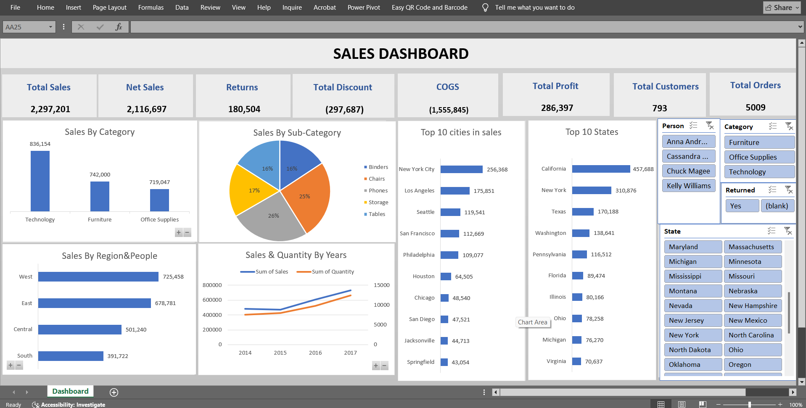

# Interactive Sales Performance Dashboard

An interactive, executive-ready Excel Sales Dashboard designed to track, analyze, and visualize retail sales data. This dashboard provides key business metrics, geographic insights, temporal trends, and product performance indicators to support data-driven decision-making.

---

## 📊 Dashboard Overview

This dashboard acts as a single source of truth for sales performance across multiple regions, categories, and timeframes. It consolidates raw transactional data into actionable high-level KPIs and detailed charts, utilizing dynamic slicers for deep-dive exploratory analysis.

### ✨ Key Features
* **Dynamic Slicers:** Filter instantly by **Product Category**, **Return Status**, **Geographic State**, and **Sales Representative**.
* **Comprehensive Financial View:** Complete breakdown from Total Sales to Net Profit, factoring in Discounts, COGS, and Returns.
* **Geographic Analysis:** View performance categorized by Top 10 States, Top 10 Cities, and Regional performance metrics[cite: 1].
* **Product Breakdown:** Analyze category contributions via column charts and sub-category market shares using segmented pie charts[cite: 1].
* **Trend Analysis:** Dual-axis line chart tracking the relationship between Sales Revenue and Quantity Sold across multiple fiscal years[cite: 1].

---

## 📈 Key Performance Indicators (KPIs)

The dashboard highlights eight core executive metrics computed dynamically from the underlying dataset[cite: 1]:

| KPI Metric | Value | Description |
| :--- | :---: | :--- |
| **Total Sales** | \$2,297,201 | Gross sales revenue generated prior to deductions[cite: 1]. |
| **Net Sales** | \$2,116,697 | Revenue retained after accounting for returned goods[cite: 1]. |
| **Returns** | \$180,504 | Value of products returned by customers[cite: 1]. |
| **Total Discount** | (\$297,687) | Cumulative promotional discounts given to customers[cite: 1]. |
| **COGS** | (\$1,555,845) | Total Cost of Goods Sold associated with completed transactions[cite: 1]. |
| **Total Profit** | \$286,397 | Net profit generated after subtracting COGS and discounts from Net Sales[cite: 1]. |
| **Total Customers** | 793 | Unique customer count across the lifetime of the data[cite: 1]. |
| **Total Orders** | 5,009 | Total volume of transactions processed[cite: 1]. |

---

## 🔍 Visualizations Explained

### 1. Product Analysis
* **Sales By Category (Column Chart):** High-level breakdown showing **Technology** leading in revenue (\$836k+), followed closely by **Furniture** (\$742k) and **Office Supplies** (\$719k)[cite: 1].
* **Sales By Sub-Category (Pie Chart):** Granular breakdown showing top-performing subcategories, with Binders, Chairs, and Phones dominating the internal revenue distribution[cite: 1].

### 2. Geographic & Team Performance
* **Top 10 Cities & States (Horizontal Bar Charts):** Identifies top revenue-driving regions, showing **California** (~$457k) and **New York City** (~$256k) as primary market strongholds[cite: 1].
* **Sales By Region & People (Horizontal Bar Chart):** Ranks regional distributions (**West** leading with \$725k+, followed by **East**, **Central**, and **South**)[cite: 1].

### 3. Historical Trends
* **Sales & Quantity By Years (Line Chart):** Illustrates a healthy, positive upward trajectory in both gross sales and physical product volume from **2014 through 2017**[cite: 1].

---

## 🛠️ Tech Stack & Tools Used
* **Microsoft Excel:** Built entirely using advanced Excel functionalities[cite: 1].
* **Power Query:** Used for data extraction, transformation, and cleaning (ETL)[cite: 1].
* **Excel PivotTables & PivotCharts:** Formed the operational logic and visual elements[cite: 1].
* **Excel Slicers:** Implemented for seamless user interactivity[cite: 1].

